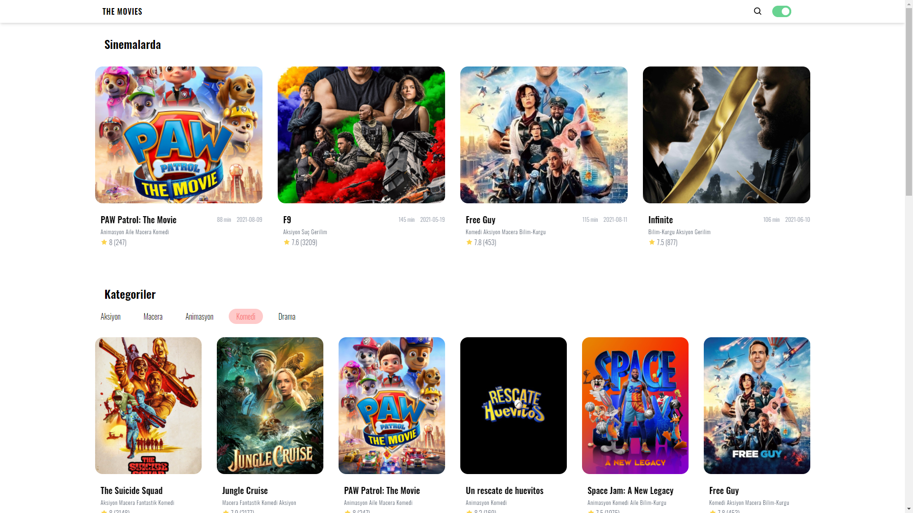
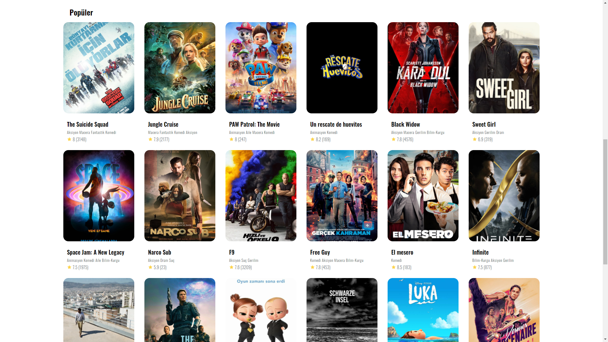
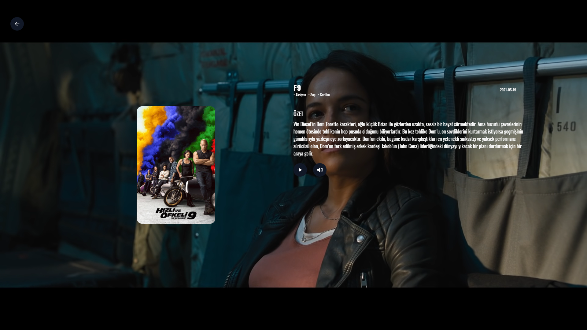
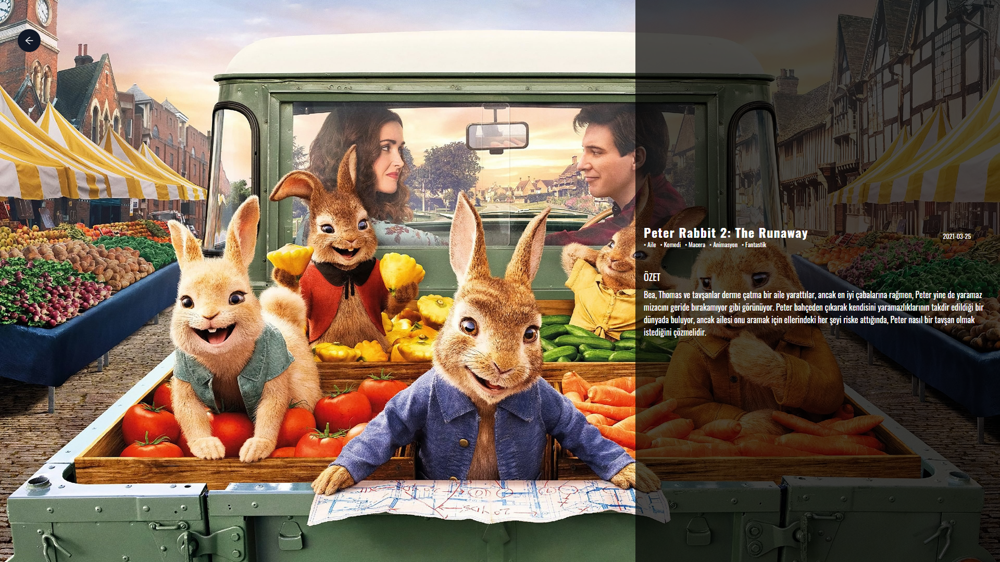
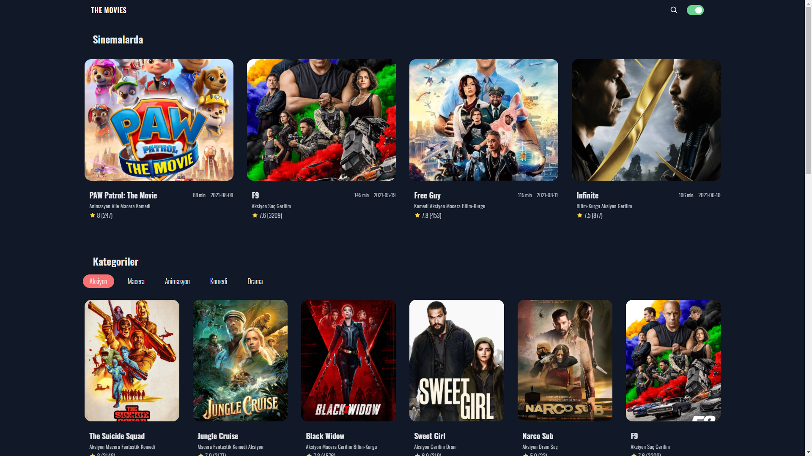

# THE MOVIES

Bu projede [themovie.db](https://www.themoviedb.org/?language=tr) api kullanarak film 
bilgileri ile bir proje ortaya çıkardım. Proje kapsamında redux kullanımı pekiştirmek için
bir çok fırsatta kullanmaya çalıştım.

## DEMO
https://heuristic-sinoussi-e1e26e.netlify.app/
  
## Kullanılan Teknolojiler
[](https://tr.reactjs.org/) 
[](https://reactrouter.com/)
[](https://redux.js.org/) 
[](https://tailwindcss.com/) 

## Ekran Görüntüleri








## Özellikler

- [x]  Açık/koyu mod geçişi
- [x]  Responsive tasarım   
- [x]  Sinemalarda olan filmlerin listelenmesi
- [x]  Kategoriye göre filtreleme
- [x]  Popüler filmleri listeleme
- [x]  Filme ait detay sayfası   
- [x]  Film arama

 
  
## Ortam Değişkenleri

Bu projeyi çalıştırmak için aşağıdaki ortam değişkenlerini .env dosyanıza eklemeniz gerekecek

| Parametre |  Açıklama                |
| :-------- |  :------------------------- |
| `REACT_APP_API_KEY` |  **Gerekli**. API anahtarınız. |
 
 
## Bilgisayarınızda Çalıştırın

Projeyi klonlayın

```bash
  git clone https://link-to-project
```

Proje dizinine gidin

```bash
  cd my-project
```

Gerekli paketleri yükleyin

```bash
  npm install
```

Sunucuyu çalıştırın

```bash
  npm run start
```
  
## Geri Bildirim

Herhangi bir geri bildiriminiz varsa, lütfen yasinbeyazli29@gmail.com adresinden bana 
ulaşabilirsiniz.

  